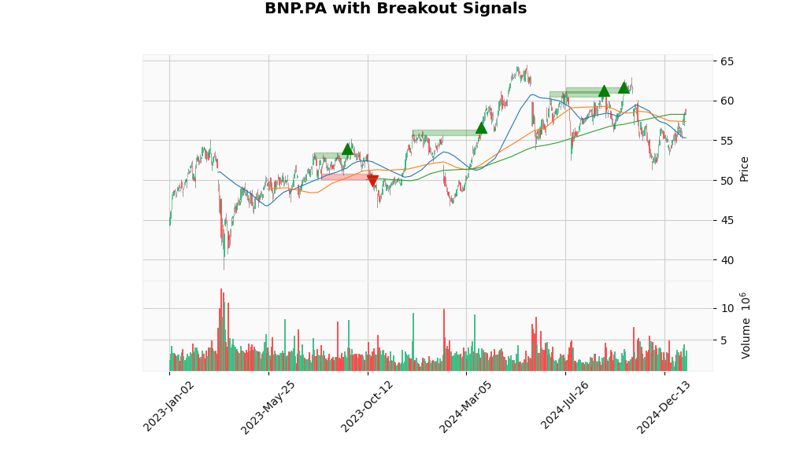

# portfolio_helper
Simple tool to help track your investments

# To get started

Create a virtual environment:

```
python3 -m venv venv
source venv/bin/activate
pip install -r requirements.txt
```

# Goal

The goal of this project is to help me track stocks, using customs analytics. So far, my program automatically calculates (quite badly) support levels and resistance levels.




# Ressources

To edit the figures from ```mpl finance```, you should refer to the GitHub page: https://github.com/matplotlib/mplfinance/tree/master/examples 